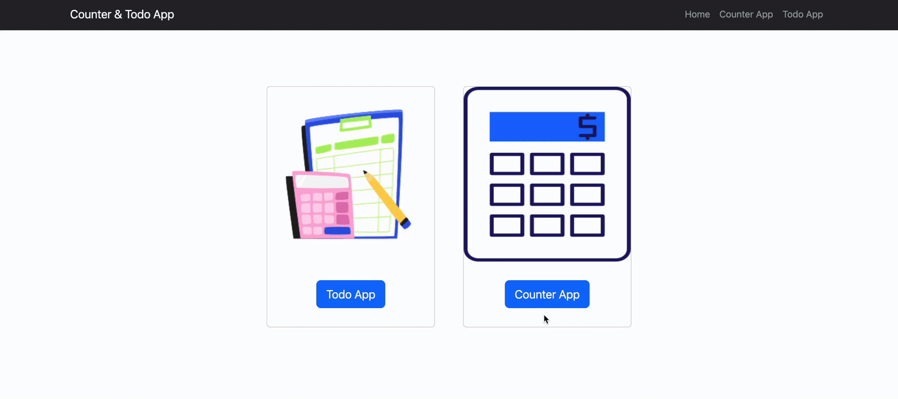
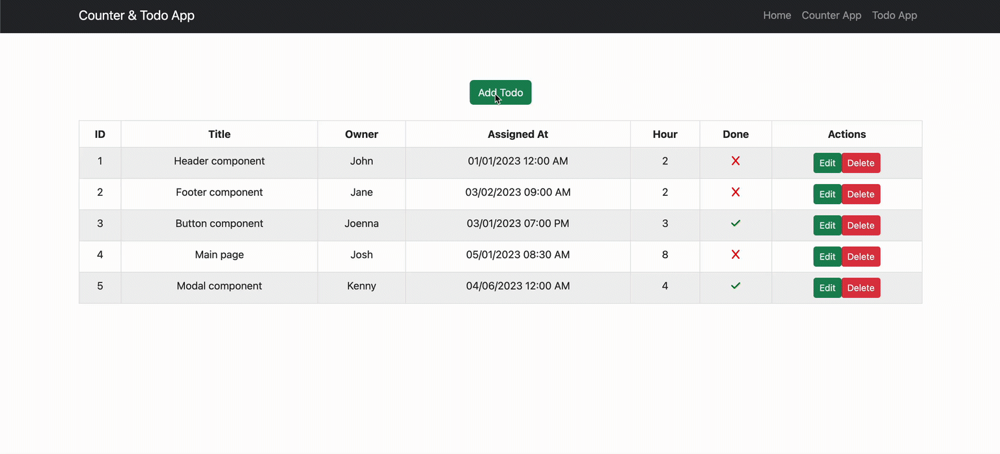

<h1>This App is created with ViteJS</h1>

<h3>What dependencies in this app?</h3>
<ul style="font-size: 18px;">
  <li>Bootstrap</li>
  <li>Redux Toolkit</li>
  <li>Font Awesome</li>
  <li>React-Router-Dom</li>
  <li>React-Datetime</li>
</ul>

<h3>Which array methods in this app?</h3>
<ul style="font-size: 18px;">
  <li>splice</li>
  <li>map</li>
  <li>findIndex</li>
</ul>

 

 

 
